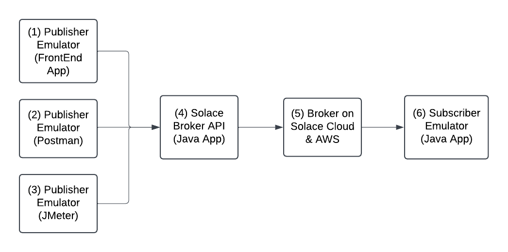

# Architecture

## Overview

This repository is organized as a small three-module Solace workspace:

- `solace-publisher-ui`: browser-based operator UI
- `solace-broker-api`: HTTP API for publish, persistence, retry, and querying
- `solace-subscriber`: direct Solace subscriber for topic traffic

At a high level:

1. the UI sends publish and query requests to `solace-broker-api`
   other HTTP clients such as Postman, JMeter, or custom tools can call the same broker API endpoints directly
2. the broker API persists publish attempts and sends messages to Solace
3. the subscriber independently listens to Solace topics and logs inbound traffic

## Module Responsibilities

### `solace-publisher-ui`

Owns:

- typed publish form
- client-side validation
- stored-message browser
- lifecycle/date filter presets
- single-message and bulk retry actions for failed rows
- manual reconciliation action for stale pending rows

Does not own:

- direct Solace connectivity
- server-side credentials
- message persistence

### `solace-broker-api`

Owns:

- HTTP publish endpoint
- publish lifecycle tracking
- retry endpoint
- persistence to the database
- paginated and filtered read API
- typed success and error responses

Does not own:

- direct browser rendering
- long-running subscription behavior

The broker API is not frontend-exclusive. It can be called by `solace-publisher-ui`, Postman, JMeter, or any other HTTP client that speaks the documented request contract.

### `solace-subscriber`

Owns:

- direct Solace subscription
- reconnect/discard logging
- runtime visibility into inbound topic traffic

Does not own:

- message persistence
- publish lifecycle state
- browser/API read workflows

## Publish Flow

The normal publish flow is:

1. `solace-publisher-ui` sends `POST /api/v1/messages/message`
2. `solace-broker-api` saves the request as `PENDING`
3. `solace-broker-api` attempts broker publish
4. if publish succeeds:
   - the record becomes `PUBLISHED`
   - `publishedAt` is set
   - the API returns a typed success DTO
5. if publish fails:
   - the record becomes `FAILED`
   - `failureReason` is set
   - the API returns a typed error response

Important boundary:

- user-supplied broker credentials may be accepted on publish requests
- those connection parameters are not persisted with the stored message

## Persistence Model And Lifecycle

Stored messages represent publish attempts, not only successful publishes.

Each stored message can include:

- `publishStatus`
- `failureReason`
- `publishedAt`
- `stalePending` as a derived operational flag
- `innerMessageId` as descriptive payload metadata
- normalized `properties` as a key/value map in API responses
- payload plus audit timestamps

Lifecycle states:

- `PENDING`: accepted and waiting for broker outcome
- `PUBLISHED`: successfully published
- `FAILED`: publish attempt failed

Stale pending signal:

- `stalePending` is derived when a message is still `PENDING` more than 5 minutes after `createdAt`
- this does not change the stored `publishStatus` by itself
- it exists to highlight rows that may need operator review after a publish/database inconsistency

`innerMessageId` is not used as a database or API uniqueness constraint. Multiple stored publish attempts may carry the same `innerMessageId`, and the persisted record `id` remains the actual stored-message identity for lifecycle and retry operations.

## Retry Flow

Retry is handled by:

- `POST /api/v1/messages/{messageId}/retry` for one stored message
- `POST /api/v1/messages/retry` for batch retry by id list

Rules:

- only `FAILED` messages can be retried
- the retry uses server-side Solace configuration
- the same stored message record is updated again

Retry sequence:

1. load stored message
2. reject unless status is `FAILED`
3. mark it `PENDING`
4. attempt publish again
5. mark it `PUBLISHED` or `FAILED`

The UI supports both:

- retrying one failed message
- retrying all currently visible failed messages in the browser

The bulk retry action now delegates to the backend batch endpoint instead of sending one browser request per message.

## Stale Pending Reconciliation Flow

Manual reconciliation is handled by `POST /api/v1/messages/{messageId}/reconcile-stale-pending`.

Rules:

- only `PENDING` messages can be reconciled
- the message must be stale under the same 5-minute threshold used by the read DTO
- reconciliation does not attempt another broker publish
- the same stored message record is updated to `FAILED`
- `failureReason` is set to an explicit manual reconciliation message

Reconciliation sequence:

1. load stored message
2. reject unless status is `PENDING`
3. reject unless the row is stale
4. mark it `FAILED`
5. return the updated stored-message DTO

Operational distinction:

- retry is for retryable `FAILED` messages
- manual reconciliation is for stale `PENDING` messages that need operator classification without republishing

## Read Flow

The stored-message browser calls `GET /api/v1/messages/all`.

The broker API supports:

- pagination
- sorting
- text filters for `destination`, `deliveryMode`, and `innerMessageId`
- `publishStatus` filtering
- `stalePendingOnly=true` filtering for stale `PENDING` rows
- date-range filtering on `createdAt`
- date-range filtering on `publishedAt`
- lifecycle aggregate counts for the full filtered result set

The UI layers on:

- quick presets such as `failed today`
- clickable lifecycle summary pills for `published`, `failed`, `pending`, and stale pending
- page-level lifecycle counts derived from the currently loaded items
- refresh/reset behavior
- detail expansion
- copy actions

Important distinction:

- backend `lifecycleCounts` describe the full filtered result set across all pages
- backend retryability counts describe how many failed rows are retryable versus blocked
- UI page counts describe only the items currently loaded in `items`

## Subscriber Role

`solace-subscriber` is intentionally separate from the broker API persistence model.

It observes direct topic traffic from Solace and is useful for:

- confirming that published messages are reaching the broker/topic
- watching reconnect and discard conditions
- validating topic traffic independently from the database/browser view

It does not read from the broker API database.

## Shared Configuration Boundaries

Shared environment variables used by the backend and subscriber:

- `SOLACE_CLOUD_HOST`
- `SOLACE_CLOUD_VPN`
- `SOLACE_CLOUD_USERNAME`
- `SOLACE_CLOUD_PASSWORD`

The UI does not read these directly.

## Local Startup Workflow

Recommended entrypoints from the repo root:

- `make start-api`
- `make start-ui`
- `make start-subscriber`
- `make start-all`

Supporting scripts live in `scripts/`.

## CI And Verification

Current verification layers:

- backend Maven tests
- UI Vitest suite
- subscriber Maven tests
- root script smoke tests

GitHub Actions CI runs those checks on pushes and pull requests through `.github/workflows/ci.yml`.
