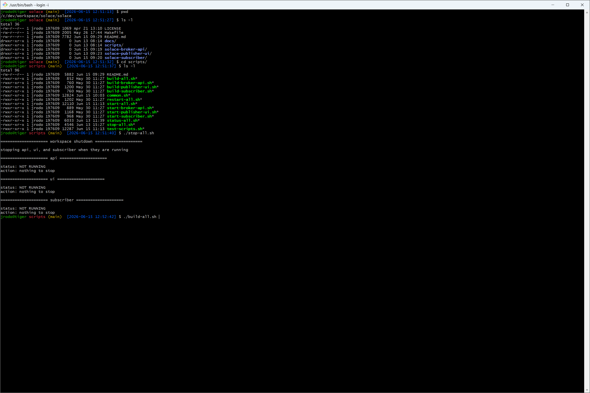
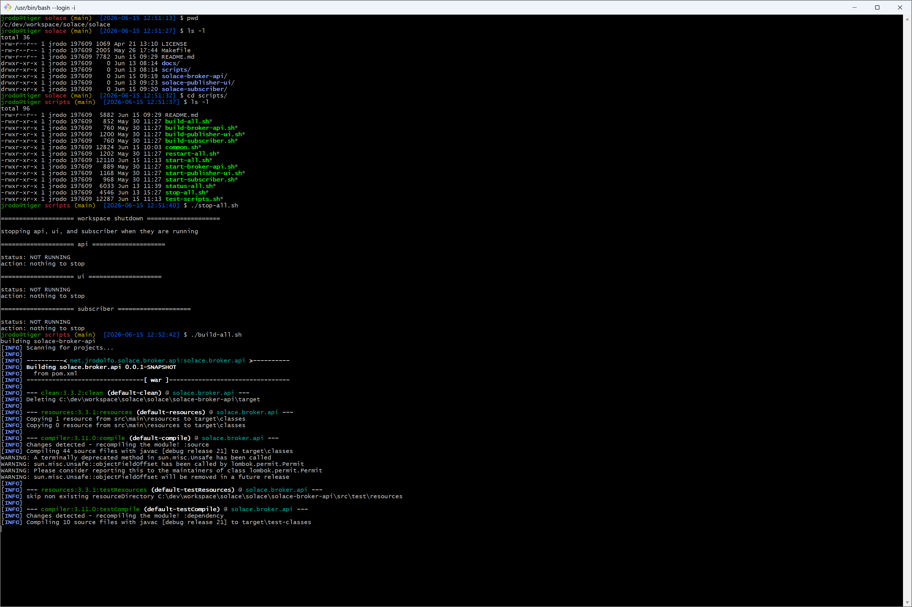
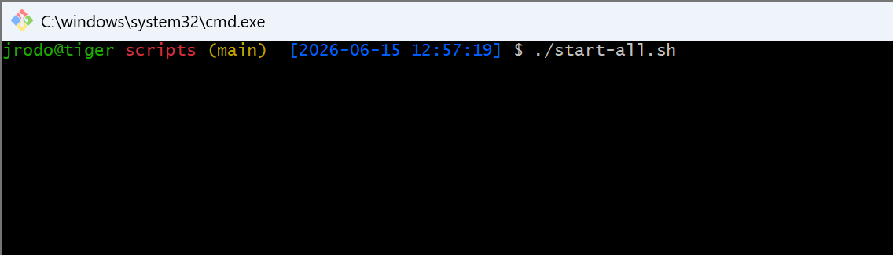
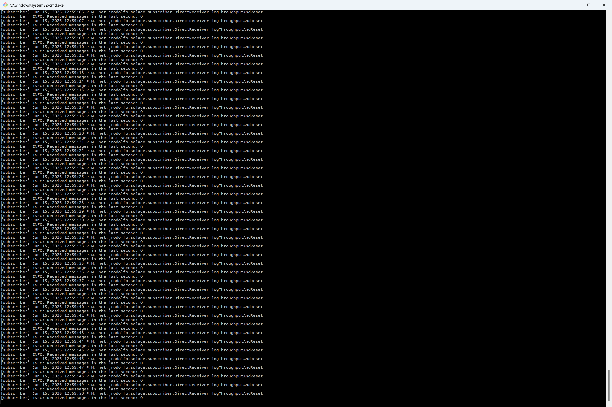
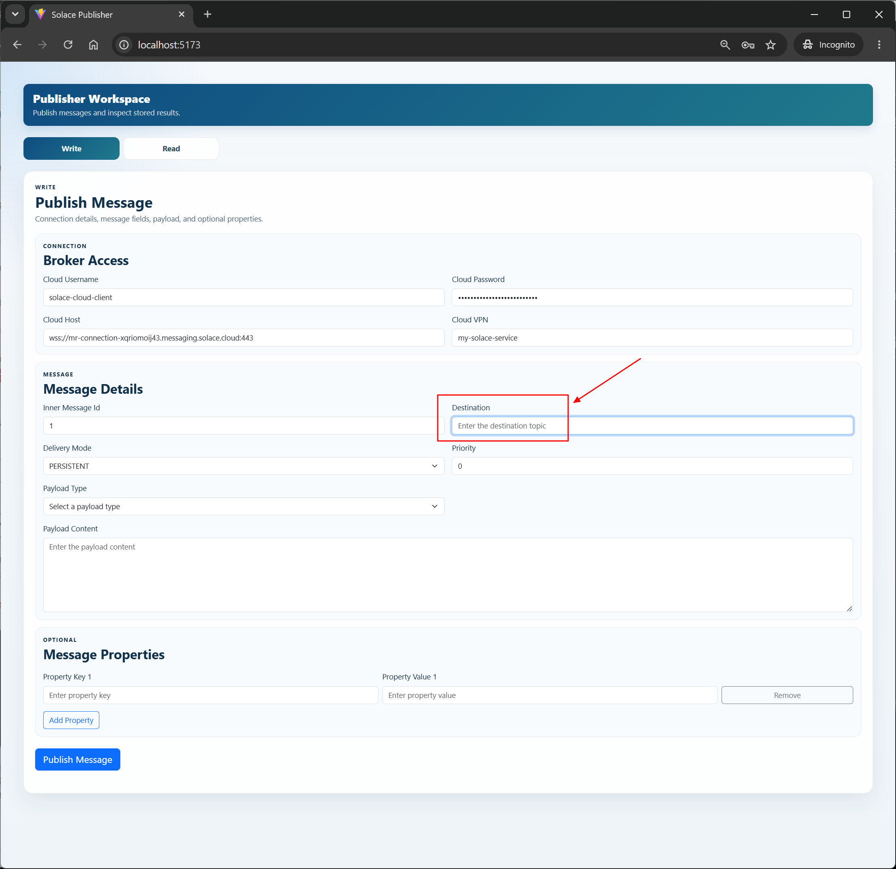

# Solace Smoke Test

This guide walks through an end-to-end smoke test using all three project
modules:

- `solace-broker-api`
- `solace-publisher-ui`
- `solace-subscriber`

The goal is to publish one message from the React UI, receive it through Solace
Cloud, observe it in the local subscriber logs, and confirm that the broker API
persisted the publish attempt in MySQL.

Use your own Solace Cloud values. The screenshots are examples only.

## Prerequisites

Before starting, make sure you have:

- Docker Desktop running
- Java 21
- Maven
- Node.js and npm
- a Solace Cloud account and event broker service
- the four `SOLACE_CLOUD_*` environment variables available in your terminal

If you still need to create the Solace Cloud account or collect the four
connection values, follow
[Solace Cloud Account, Demo, and Environment Variables](01-solace-cloud-account-demo-and-env-vars.md)
first.

The smoke test uses the sample destinations documented in
[../reference/sample-destinations.md](../reference/sample-destinations.md).

## 1. Start Docker Desktop

Start Docker Desktop before running the project scripts. The broker API starts a
local MySQL container through Docker Compose.


## 2. Build the Three Modules

From the repository root, run the build scripts:

```bash
cd scripts
./stop-all.sh
./build-all.sh
```

`stop-all.sh` clears any previous local run. `build-all.sh` builds the broker
API, publisher UI, and subscriber.





## 3. Start the Three Modules

From the `scripts` directory, start the complete local stack:

```bash
./start-all.sh
```

The first run can take longer because Docker may need to download the MySQL
image.





## 4. Confirm MySQL in Docker Desktop

Open Docker Desktop and confirm that the MySQL image and container are present.
The broker API uses this local database to store publish attempts.


## 5. Open the Publisher UI

Open the React publisher UI in your browser:

```text
http://localhost:5173
```

If `5173` was already busy, use the Vite URL printed by `start-all.sh`.


## 6. Open Solace Cloud

Log in to Solace Cloud:

```text
https://console.solace.cloud/login
```


Open **Cluster Manager**, select your broker service, and then select
**Open Broker Manager**.


## 7. Connect Broker Manager Publisher and Subscriber

In Broker Manager, open **Try Me!** and select **Connect** in both the publisher
and subscriber panels.


Edit the **Topic Subscriber** field.


Use this subscriber topic pattern:

```text
solace/java/direct/system-0*
```

That value is documented in
[../reference/sample-destinations.md](../reference/sample-destinations.md).


Select **Subscribe**.


Confirm that the topic appears under **Subscribed Topics**.


## 8. Collect the Solace Cloud Connection Values

In Solace Cloud, collect the four values required by this project:

- broker URL for `SOLACE_CLOUD_HOST`
- message VPN for `SOLACE_CLOUD_VPN`
- client username for `SOLACE_CLOUD_USERNAME`
- client password for `SOLACE_CLOUD_PASSWORD`


Enter those values in the **Connection Broker Access** section of the publisher
UI.


## 9. Fill Out the Publish Form

For the **Destination** field, use:

```text
solace/java/direct/system-01
```

That value is also documented in
[../reference/sample-destinations.md](../reference/sample-destinations.md).

Message properties are optional.




When the form is complete, select **Publish Message**.


The UI should show a successful publish response.


## 10. Verify Logs and Solace Cloud

Check the terminal running `start-all.sh`. You should see logs from both:

- `solace-broker-api`
- `solace-subscriber`

The subscriber log should show that it received the message published to
`solace/java/direct/system-01`.


In Broker Manager, confirm that the subscribed topic receives the message.


## 11. Verify the Message in the Publisher UI Read Tab

The publisher UI can also confirm that the broker API persisted the publish
attempt. Open the read/stored-messages tab, load the records, and verify that
the latest message shows the expected destination, payload, lifecycle status,
and timestamps.


## 12. Verify the Database

You can inspect the stored publish attempt in MySQL. One GUI option is
Beekeeper Studio Community Edition:

```text
https://www.beekeeperstudio.io
```

Use these connection settings:

| Field | Value |
| --- | --- |
| Connection type | `MySQL` |
| Host | `localhost` |
| Port | `3307` |
| User | `myuser` |
| Password | `secret` |
| Database | `solace` |

The smoke-test database queries are available in
[../mysql/smoke-test-queries.sql](../mysql/smoke-test-queries.sql).

In IntelliJ, open that SQL file, select the `solace` MySQL data source, and run
the queries directly from the editor.

For the schema reference, see
[../mysql/mysql-schema.sql](../mysql/mysql-schema.sql).

## If the Database Connection Fails

Make sure the MySQL container is running:

```bash
docker ps --filter name=solace-mysql
```

If it is not running, start it from the broker API module:

```bash
cd solace-broker-api
docker compose up -d mysql
```

Then retry the Beekeeper Studio connection. If `localhost` does not work on
your machine, use `127.0.0.1` with the same port, `3307`.
